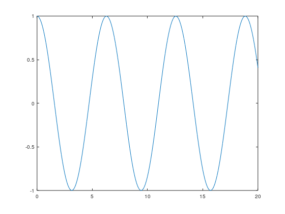

x =

 Columns 1 through 8:

         0    0.1000    0.2000    0.3000    0.4000    0.5000    0.6000    0.7000

 Columns 9 through 16:

    0.8000    0.9000    1.0000    1.1000    1.2000    1.3000    1.4000    1.5000

 Columns 17 through 24:

    1.6000    1.7000    1.8000    1.9000    2.0000    2.1000    2.2000    2.3000

 Columns 25 through 32:

    2.4000    2.5000    2.6000    2.7000    2.8000    2.9000    3.0000    3.1000

 Columns 33 through 40:

    3.2000    3.3000    3.4000    3.5000    3.6000    3.7000    3.8000    3.9000

 Columns 41 through 48:

    4.0000    4.1000    4.2000    4.3000    4.4000    4.5000    4.6000    4.7000

 Columns 49 through 56:

    4.8000    4.9000    5.0000    5.1000    5.2000    5.3000    5.4000    5.5000

 Columns 57 through 64:

    5.6000    5.7000    5.8000    5.9000    6.0000    6.1000    6.2000    6.3000

 Columns 65 through 72:

    6.4000    6.5000    6.6000    6.7000    6.8000    6.9000    7.0000    7.1000

 Columns 73 through 80:

    7.2000    7.3000    7.4000    7.5000    7.6000    7.7000    7.8000    7.9000

 Columns 81 through 88:

    8.0000    8.1000    8.2000    8.3000    8.4000    8.5000    8.6000    8.7000

 Columns 89 through 96:

    8.8000    8.9000    9.0000    9.1000    9.2000    9.3000    9.4000    9.5000

 Columns 97 through 104:

    9.6000    9.7000    9.8000    9.9000   10.0000   10.1000   10.2000   10.3000

 Columns 105 through 112:

   10.4000   10.5000   10.6000   10.7000   10.8000   10.9000   11.0000   11.1000

 Columns 113 through 120:

   11.2000   11.3000   11.4000   11.5000   11.6000   11.7000   11.8000   11.9000

 Columns 121 through 128:

   12.0000   12.1000   12.2000   12.3000   12.4000   12.5000   12.6000   12.7000

 Columns 129 through 136:

   12.8000   12.9000   13.0000   13.1000   13.2000   13.3000   13.4000   13.5000

 Columns 137 through 144:

   13.6000   13.7000   13.8000   13.9000   14.0000   14.1000   14.2000   14.3000

 Columns 145 through 152:

   14.4000   14.5000   14.6000   14.7000   14.8000   14.9000   15.0000   15.1000

 Columns 153 through 160:

   15.2000   15.3000   15.4000   15.5000   15.6000   15.7000   15.8000   15.9000

 Columns 161 through 168:

   16.0000   16.1000   16.2000   16.3000   16.4000   16.5000   16.6000   16.7000

 Columns 169 through 176:

   16.8000   16.9000   17.0000   17.1000   17.2000   17.3000   17.4000   17.5000

 Columns 177 through 184:

   17.6000   17.7000   17.8000   17.9000   18.0000   18.1000   18.2000   18.3000

 Columns 185 through 192:

   18.4000   18.5000   18.6000   18.7000   18.8000   18.9000   19.0000   19.1000

 Columns 193 through 200:

   19.2000   19.3000   19.4000   19.5000   19.6000   19.7000   19.8000   19.9000

 Column 201:

   20.0000

z =

 Columns 1 through 6:

   1.0000e+00   9.9500e-01   9.8007e-01   9.5534e-01   9.2106e-01   8.7758e-01

 Columns 7 through 12:

   8.2534e-01   7.6484e-01   6.9671e-01   6.2161e-01   5.4030e-01   4.5360e-01

 Columns 13 through 18:

   3.6236e-01   2.6750e-01   1.6997e-01   7.0737e-02  -2.9200e-02  -1.2884e-01

 Columns 19 through 24:

  -2.2720e-01  -3.2329e-01  -4.1615e-01  -5.0485e-01  -5.8850e-01  -6.6628e-01

 Columns 25 through 30:

  -7.3739e-01  -8.0114e-01  -8.5689e-01  -9.0407e-01  -9.4222e-01  -9.7096e-01

 Columns 31 through 36:

  -9.8999e-01  -9.9914e-01  -9.9829e-01  -9.8748e-01  -9.6680e-01  -9.3646e-01

 Columns 37 through 42:

  -8.9676e-01  -8.4810e-01  -7.9097e-01  -7.2593e-01  -6.5364e-01  -5.7482e-01

 Columns 43 through 48:

  -4.9026e-01  -4.0080e-01  -3.0733e-01  -2.1080e-01  -1.1215e-01  -1.2389e-02

 Columns 49 through 54:

   8.7499e-02   1.8651e-01   2.8366e-01   3.7798e-01   4.6852e-01   5.5437e-01

 Columns 55 through 60:

   6.3469e-01   7.0867e-01   7.7557e-01   8.3471e-01   8.8552e-01   9.2748e-01

 Columns 61 through 66:

   9.6017e-01   9.8327e-01   9.9654e-01   9.9986e-01   9.9318e-01   9.7659e-01

 Columns 67 through 72:

   9.5023e-01   9.1438e-01   8.6940e-01   8.1573e-01   7.5390e-01   6.8455e-01

 Columns 73 through 78:

   6.0835e-01   5.2608e-01   4.3855e-01   3.4664e-01   2.5126e-01   1.5337e-01

 Columns 79 through 84:

   5.3955e-02  -4.6002e-02  -1.4550e-01  -2.4354e-01  -3.3915e-01  -4.3138e-01

 Columns 85 through 90:

  -5.1929e-01  -6.0201e-01  -6.7872e-01  -7.4865e-01  -8.1109e-01  -8.6544e-01

 Columns 91 through 96:

  -9.1113e-01  -9.4772e-01  -9.7484e-01  -9.9223e-01  -9.9969e-01  -9.9717e-01

 Columns 97 through 102:

  -9.8469e-01  -9.6236e-01  -9.3043e-01  -8.8919e-01  -8.3907e-01  -7.8057e-01

 Columns 103 through 108:

  -7.1427e-01  -6.4083e-01  -5.6098e-01  -4.7554e-01  -3.8534e-01  -2.9129e-01

 Columns 109 through 114:

  -1.9433e-01  -9.5429e-02   4.4257e-03   1.0424e-01   2.0300e-01   2.9975e-01

 Columns 115 through 120:

   3.9349e-01   4.8330e-01   5.6829e-01   6.4760e-01   7.2043e-01   7.8607e-01

 Columns 121 through 126:

   8.4385e-01   8.9321e-01   9.3363e-01   9.6473e-01   9.8619e-01   9.9780e-01

 Columns 127 through 132:

   9.9943e-01   9.9108e-01   9.7283e-01   9.4486e-01   9.0745e-01   8.6097e-01

 Columns 133 through 138:

   8.0588e-01   7.4275e-01   6.7219e-01   5.9492e-01   5.1170e-01   4.2337e-01

 Columns 139 through 144:

   3.3081e-01   2.3495e-01   1.3674e-01   3.7158e-02  -6.2792e-02  -1.6211e-01

 Columns 145 through 150:

  -2.5982e-01  -3.5492e-01  -4.4648e-01  -5.3358e-01  -6.1535e-01  -6.9097e-01

 Columns 151 through 156:

  -7.5969e-01  -8.2081e-01  -8.7374e-01  -9.1793e-01  -9.5295e-01  -9.7845e-01

 Columns 157 through 162:

  -9.9418e-01  -9.9997e-01  -9.9577e-01  -9.8162e-01  -9.5766e-01  -9.2413e-01

 Columns 163 through 168:

  -8.8137e-01  -8.2981e-01  -7.6995e-01  -7.0240e-01  -6.2783e-01  -5.4699e-01

 Columns 169 through 174:

  -4.6068e-01  -3.6977e-01  -2.7516e-01  -1.7781e-01  -7.8678e-02   2.1239e-02

 Columns 175 through 180:

   1.2094e-01   2.1944e-01   3.1574e-01   4.0889e-01   4.9796e-01   5.8204e-01

 Columns 181 through 186:

   6.6032e-01   7.3199e-01   7.9635e-01   8.5276e-01   9.0064e-01   9.3952e-01

 Columns 187 through 192:

   9.6902e-01   9.8884e-01   9.9877e-01   9.9873e-01   9.8870e-01   9.6880e-01

 Columns 193 through 198:

   9.3922e-01   9.0025e-01   8.5229e-01   7.9581e-01   7.3139e-01   6.5965e-01

 Columns 199 through 201:

   5.8132e-01   4.9719e-01   4.0808e-01

[Execution complete with exit code 0]

