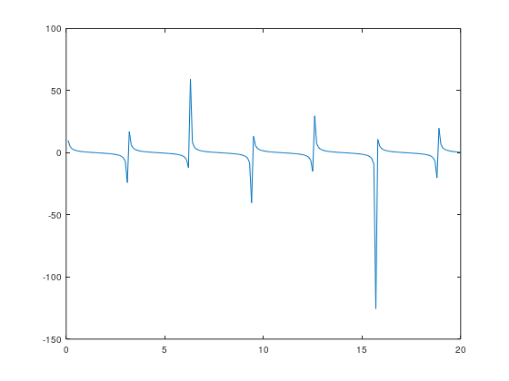

x =

 Columns 1 through 8:

         0    0.1000    0.2000    0.3000    0.4000    0.5000    0.6000    0.7000

 Columns 9 through 16:

    0.8000    0.9000    1.0000    1.1000    1.2000    1.3000    1.4000    1.5000

 Columns 17 through 24:

    1.6000    1.7000    1.8000    1.9000    2.0000    2.1000    2.2000    2.3000

 Columns 25 through 32:

    2.4000    2.5000    2.6000    2.7000    2.8000    2.9000    3.0000    3.1000

 Columns 33 through 40:

    3.2000    3.3000    3.4000    3.5000    3.6000    3.7000    3.8000    3.9000

 Columns 41 through 48:

    4.0000    4.1000    4.2000    4.3000    4.4000    4.5000    4.6000    4.7000

 Columns 49 through 56:

    4.8000    4.9000    5.0000    5.1000    5.2000    5.3000    5.4000    5.5000

 Columns 57 through 64:

    5.6000    5.7000    5.8000    5.9000    6.0000    6.1000    6.2000    6.3000

 Columns 65 through 72:

    6.4000    6.5000    6.6000    6.7000    6.8000    6.9000    7.0000    7.1000

 Columns 73 through 80:

    7.2000    7.3000    7.4000    7.5000    7.6000    7.7000    7.8000    7.9000

 Columns 81 through 88:

    8.0000    8.1000    8.2000    8.3000    8.4000    8.5000    8.6000    8.7000

 Columns 89 through 96:

    8.8000    8.9000    9.0000    9.1000    9.2000    9.3000    9.4000    9.5000

 Columns 97 through 104:

    9.6000    9.7000    9.8000    9.9000   10.0000   10.1000   10.2000   10.3000

 Columns 105 through 112:

   10.4000   10.5000   10.6000   10.7000   10.8000   10.9000   11.0000   11.1000

 Columns 113 through 120:

   11.2000   11.3000   11.4000   11.5000   11.6000   11.7000   11.8000   11.9000

 Columns 121 through 128:

   12.0000   12.1000   12.2000   12.3000   12.4000   12.5000   12.6000   12.7000

 Columns 129 through 136:

   12.8000   12.9000   13.0000   13.1000   13.2000   13.3000   13.4000   13.5000

 Columns 137 through 144:

   13.6000   13.7000   13.8000   13.9000   14.0000   14.1000   14.2000   14.3000

 Columns 145 through 152:

   14.4000   14.5000   14.6000   14.7000   14.8000   14.9000   15.0000   15.1000

 Columns 153 through 160:

   15.2000   15.3000   15.4000   15.5000   15.6000   15.7000   15.8000   15.9000

 Columns 161 through 168:

   16.0000   16.1000   16.2000   16.3000   16.4000   16.5000   16.6000   16.7000

 Columns 169 through 176:

   16.8000   16.9000   17.0000   17.1000   17.2000   17.3000   17.4000   17.5000

 Columns 177 through 184:

   17.6000   17.7000   17.8000   17.9000   18.0000   18.1000   18.2000   18.3000

 Columns 185 through 192:

   18.4000   18.5000   18.6000   18.7000   18.8000   18.9000   19.0000   19.1000

 Columns 193 through 200:

   19.2000   19.3000   19.4000   19.5000   19.6000   19.7000   19.8000   19.9000

 Column 201:

   20.0000

z =

 Columns 1 through 6:

          Inf   9.9666e+00   4.9332e+00   3.2327e+00   2.3652e+00   1.8305e+00

 Columns 7 through 12:

   1.4617e+00   1.1872e+00   9.7121e-01   7.9355e-01   6.4209e-01   5.0897e-01

 Columns 13 through 18:

   3.8878e-01   2.7762e-01   1.7248e-01   7.0915e-02  -2.9212e-02  -1.2993e-01

 Columns 19 through 24:

  -2.3330e-01  -3.4164e-01  -4.5766e-01  -5.8485e-01  -7.2790e-01  -8.9348e-01

 Columns 25 through 30:

  -1.0917e+00  -1.3386e+00  -1.6622e+00  -2.1154e+00  -2.8127e+00  -4.0584e+00

 Columns 31 through 36:

  -7.0153e+00  -2.4029e+01   1.7102e+01   6.2599e+00   3.7833e+00   2.6696e+00

 Columns 37 through 42:

   2.0265e+00   1.6007e+00   1.2927e+00   1.0555e+00   8.6369e-01   7.0248e-01

 Columns 43 through 48:

   5.6250e-01   4.3747e-01   3.2296e-01   2.1564e-01   1.1286e-01   1.2390e-02

 Columns 49 through 54:

  -8.7836e-02  -1.8984e-01  -2.9581e-01  -4.0827e-01  -5.3032e-01  -6.6610e-01

 Columns 55 through 60:

  -8.2133e-01  -1.0044e+00  -1.2286e+00  -1.5158e+00  -1.9060e+00  -2.4807e+00

 Columns 61 through 66:

  -3.4364e+00  -5.3978e+00  -1.1994e+01   5.9466e+01   8.5216e+00   4.5397e+00

 Columns 67 through 72:

   3.0501e+00   2.2586e+00   1.7595e+00   1.4102e+00   1.1475e+00   9.3906e-01

 Columns 73 through 78:

   7.6651e-01   6.1860e-01   4.8798e-01   3.6955e-01   2.5959e-01   1.5521e-01

 Columns 79 through 84:

   5.4034e-02  -4.6051e-02  -1.4707e-01  -2.5110e-01  -3.6052e-01  -4.7815e-01

 Columns 85 through 90:

  -6.0764e-01  -7.5394e-01  -9.2419e-01  -1.1292e+00  -1.3867e+00  -1.7273e+00

 Columns 91 through 96:

  -2.2108e+00  -2.9700e+00  -4.3737e+00  -7.9726e+00  -4.0350e+01   1.3269e+01

 Columns 97 through 102:

   5.6485e+00   3.5412e+00   2.5388e+00   1.9434e+00   1.5424e+00   1.2488e+00

 Columns 103 through 108:

   1.0206e+00   8.3475e-01   6.7766e-01   5.4057e-01   4.1759e-01   3.0449e-01

 Columns 109 through 114:

   1.9811e-01   9.5866e-02  -4.4257e-03  -1.0481e-01  -2.0732e-01  -3.1419e-01

 Columns 115 through 120:

  -4.2802e-01  -5.5206e-01  -6.9065e-01  -8.4988e-01  -1.0388e+00  -1.2717e+00

 Columns 121 through 126:

  -1.5727e+00  -1.9865e+00  -2.6062e+00  -3.6650e+00  -5.9551e+00  -1.5045e+01

 Columns 127 through 132:

   2.9725e+01   7.4388e+00   4.2021e+00   2.8853e+00   2.1597e+00   1.6926e+00

 Columns 133 through 138:

   1.3611e+00   1.1093e+00   9.0791e-01   7.4015e-01   5.9559e-01   4.6732e-01

 Columns 139 through 144:

   3.5055e-01   2.4172e-01   1.3803e-01   3.7184e-02  -6.2916e-02  -1.6429e-01

 Columns 145 through 150:

  -2.6906e-01  -3.7964e-01  -4.9898e-01  -6.3090e-01  -7.8065e-01  -9.5586e-01

 Columns 151 through 156:

  -1.1682e+00  -1.4370e+00  -1.7963e+00  -2.3137e+00  -3.1438e+00  -4.7390e+00

 Columns 157 through 162:

  -9.2264e+00  -1.2557e+02   1.0835e+01   5.1432e+00   3.3263e+00   2.4187e+00

 Columns 163 through 168:

   1.8656e+00   1.4870e+00   1.2066e+00   9.8681e-01   8.0661e-01   6.5340e-01

 Columns 169 through 174:

   5.1904e-01   3.9798e-01   2.8621e-01   1.8069e-01   7.8923e-02  -2.1244e-02

 Columns 175 through 180:

  -1.2184e-01  -2.2492e-01  -3.3277e-01  -4.4806e-01  -5.7421e-01  -7.1578e-01

 Columns 181 through 186:

  -8.7926e-01  -1.0744e+00  -1.3166e+00  -1.6327e+00  -2.0725e+00  -2.7433e+00

 Columns 187 through 192:

  -3.9236e+00  -6.6365e+00  -2.0163e+01   1.9807e+01   6.5968e+00   3.9091e+00

 Columns 193 through 198:

   2.7357e+00   2.0678e+00   1.6294e+00   1.3142e+00   1.0725e+00   8.7769e-01

 Columns 199 through 201:

   7.1444e-01   5.7303e-01   4.4700e-01

[Execution complete with exit code 0]

