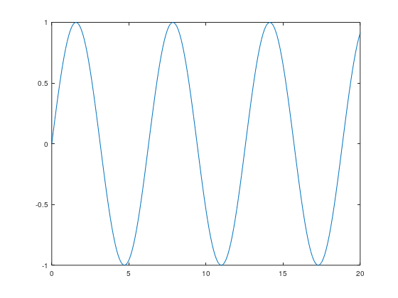
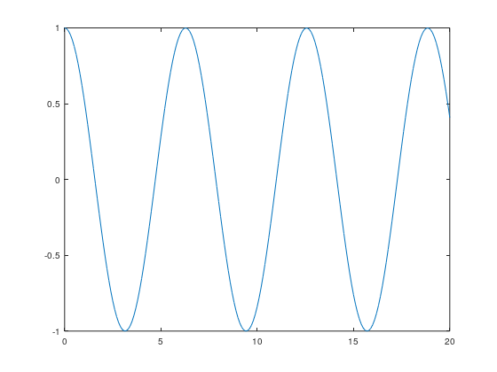
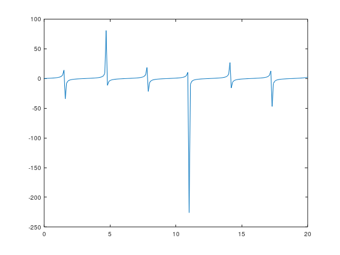
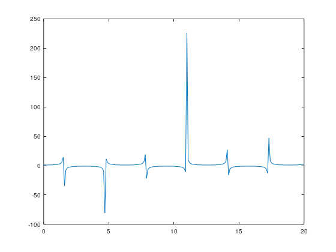
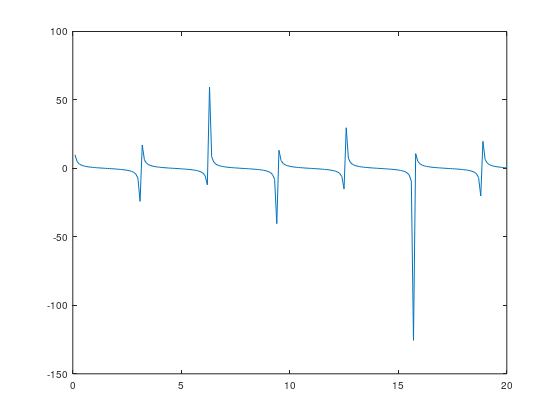

# MATLAB

Welcome to the MATLAB repository! This repository contains MATLAB scripts and functions for various mathematical operations and graph plotting. Below is an overview of the topics covered and the corresponding MATLAB scripts available in this repository.

## Topics

1. **[Sin Graph](https://github.com/ThisIs-Developer/MatLab/tree/main/Sin%20Graph)**
2. **[Cos Graph](https://github.com/ThisIs-Developer/MatLab/tree/main/Cos%20Graph)**
3. **[Tan Graph](https://github.com/ThisIs-Developer/MatLab/tree/main/Tan%20Graph)**
4. **[Sec Graph](https://github.com/ThisIs-Developer/MatLab/tree/main/Sec%20Graph)**
5. **[Cot Graph](https://github.com/ThisIs-Developer/MatLab/tree/main/Cot%20Graph)**
6. **[Array](https://github.com/ThisIs-Developer/MatLab/tree/main/Array)**
7. **[Exponential Sin](https://github.com/ThisIs-Developer/MatLab/tree/main/Exponential%20Sin)**
8. **[Multiple Operation](https://github.com/ThisIs-Developer/MatLab/tree/main/Multiple%20Operation)**
9. **[Operation Float](https://github.com/ThisIs-Developer/MatLab/tree/main/Operation%20Float)**
10. **[Operation Unsin Int](https://github.com/ThisIs-Developer/MatLab/tree/main/Operation%20Unsin%20Int)**
11. **[Power Loop](https://github.com/ThisIs-Developer/MatLab/tree/main/Power%20Loop)**
12. **[Sum of Loop](https://github.com/ThisIs-Developer/MatLab/tree/main/Sum%20of%20Loop)**
13. **[Trigonometric](https://github.com/ThisIs-Developer/MatLab/tree/main/Trigonometric)**
14. **[While](https://github.com/ThisIs-Developer/MatLab/tree/main/While)**

## Scripts

### Sin Graph
- [plot_sin_graph.m](https://github.com/ThisIs-Developer/MatLab/blob/main/Sin%20Graph/plot_sin_graph.m): Plot the sine function graph.

### Cos Graph
- [plot_cos_graph.m](https://github.com/ThisIs-Developer/MatLab/blob/main/Cos%20Graph/plot_cos_graph.m): Plot the cosine function graph.

### Tan Graph
- [plot_tan_graph.m](https://github.com/ThisIs-Developer/MatLab/blob/main/Tan%20Graph/plot_tan_graph.m): Plot the tangent function graph.

### Sec Graph
- [plot_sec_graph.m](https://github.com/ThisIs-Developer/MatLab/blob/main/Sec%20Graph/plot_sec_graph.m): Plot the secant function graph.

### Cot Graph
- [plot_cot_graph.m](https://github.com/ThisIs-Developer/MatLab/blob/main/Cot%20Graph/plot_cot_graph.m): Plot the cotangent function graph.

### Array
- [array_operations.m](https://github.com/ThisIs-Developer/MatLab/blob/main/Array/array_operations.m): Perform various operations on arrays such as addition, subtraction, multiplication, and division.

### Exponential Sin
- [exponential_sin.m](https://github.com/ThisIs-Developer/MatLab/blob/main/Exponential%20Sin/exponential_sin.m): Calculate and plot the exponential of the sine function.

### Multiple Operation
- [multiple_operations.m](https://github.com/ThisIs-Developer/MatLab/blob/main/Multiple%20Operation/multiple_operations.m): Perform multiple mathematical operations on given inputs.

### Operation Float
- [float_operations.m](https://github.com/ThisIs-Developer/MatLab/blob/main/Operation%20Float/float_operations.m): Perform floating-point arithmetic operations.

### Operation Unsin Int
- [unsin_int_operations.m](https://github.com/ThisIs-Developer/MatLab/blob/main/Operation%20Unsin%20Int/unsin_int_operations.m): Perform operations involving unsine and integers.

### Power Loop
- [power_loop.m](https://github.com/ThisIs-Developer/MatLab/blob/main/Power%20Loop/power_loop.m): Calculate powers using loops.

### Sum of Loop
- [sum_of_loop.m](https://github.com/ThisIs-Developer/MatLab/blob/main/Sum%20of%20Loop/sum_of_loop.m): Calculate the sum of numbers using loops.

### Trigonometric
- [trigonometric_operations.m](https://github.com/ThisIs-Developer/MatLab/blob/main/Trigonometric/trigonometric_operations.m): Perform various trigonometric operations.

### While
- [while_loop.m](https://github.com/ThisIs-Developer/MatLab/blob/main/While/while_loop.m): Demonstrate the usage of while loops for iterative calculations.

## How to Use

1. Clone this repository to your local machine.
2. Open MATLAB and navigate to the cloned directory.
3. Run the desired MATLAB script based on the topic you are interested in.

Feel free to explore and use these scripts for your mathematical computations and graph plotting needs. If you have any questions or suggestions, please open an issue or reach out to us.

---
Happy coding! 🚀
