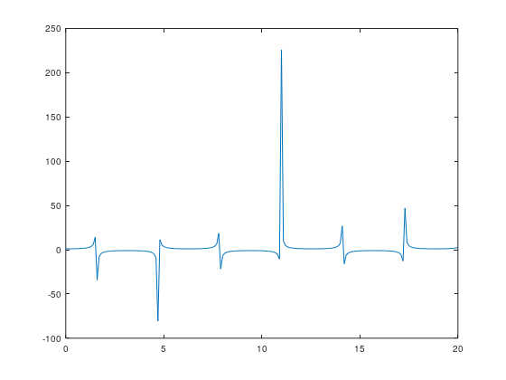

x =

 Columns 1 through 8:

         0    0.1000    0.2000    0.3000    0.4000    0.5000    0.6000    0.7000

 Columns 9 through 16:

    0.8000    0.9000    1.0000    1.1000    1.2000    1.3000    1.4000    1.5000

 Columns 17 through 24:

    1.6000    1.7000    1.8000    1.9000    2.0000    2.1000    2.2000    2.3000

 Columns 25 through 32:

    2.4000    2.5000    2.6000    2.7000    2.8000    2.9000    3.0000    3.1000

 Columns 33 through 40:

    3.2000    3.3000    3.4000    3.5000    3.6000    3.7000    3.8000    3.9000

 Columns 41 through 48:

    4.0000    4.1000    4.2000    4.3000    4.4000    4.5000    4.6000    4.7000

 Columns 49 through 56:

    4.8000    4.9000    5.0000    5.1000    5.2000    5.3000    5.4000    5.5000

 Columns 57 through 64:

    5.6000    5.7000    5.8000    5.9000    6.0000    6.1000    6.2000    6.3000

 Columns 65 through 72:

    6.4000    6.5000    6.6000    6.7000    6.8000    6.9000    7.0000    7.1000

 Columns 73 through 80:

    7.2000    7.3000    7.4000    7.5000    7.6000    7.7000    7.8000    7.9000

 Columns 81 through 88:

    8.0000    8.1000    8.2000    8.3000    8.4000    8.5000    8.6000    8.7000

 Columns 89 through 96:

    8.8000    8.9000    9.0000    9.1000    9.2000    9.3000    9.4000    9.5000

 Columns 97 through 104:

    9.6000    9.7000    9.8000    9.9000   10.0000   10.1000   10.2000   10.3000

 Columns 105 through 112:

   10.4000   10.5000   10.6000   10.7000   10.8000   10.9000   11.0000   11.1000

 Columns 113 through 120:

   11.2000   11.3000   11.4000   11.5000   11.6000   11.7000   11.8000   11.9000

 Columns 121 through 128:

   12.0000   12.1000   12.2000   12.3000   12.4000   12.5000   12.6000   12.7000

 Columns 129 through 136:

   12.8000   12.9000   13.0000   13.1000   13.2000   13.3000   13.4000   13.5000

 Columns 137 through 144:

   13.6000   13.7000   13.8000   13.9000   14.0000   14.1000   14.2000   14.3000

 Columns 145 through 152:

   14.4000   14.5000   14.6000   14.7000   14.8000   14.9000   15.0000   15.1000

 Columns 153 through 160:

   15.2000   15.3000   15.4000   15.5000   15.6000   15.7000   15.8000   15.9000

 Columns 161 through 168:

   16.0000   16.1000   16.2000   16.3000   16.4000   16.5000   16.6000   16.7000

 Columns 169 through 176:

   16.8000   16.9000   17.0000   17.1000   17.2000   17.3000   17.4000   17.5000

 Columns 177 through 184:

   17.6000   17.7000   17.8000   17.9000   18.0000   18.1000   18.2000   18.3000

 Columns 185 through 192:

   18.4000   18.5000   18.6000   18.7000   18.8000   18.9000   19.0000   19.1000

 Columns 193 through 200:

   19.2000   19.3000   19.4000   19.5000   19.6000   19.7000   19.8000   19.9000

 Column 201:

   20.0000

z =

 Columns 1 through 7:

     1.0000     1.0050     1.0203     1.0468     1.0857     1.1395     1.2116

 Columns 8 through 14:

     1.3075     1.4353     1.6087     1.8508     2.2046     2.7597     3.7383

 Columns 15 through 21:

     5.8835    14.1368   -34.2471    -7.7613    -4.4014    -3.0932    -2.4030

 Columns 22 through 28:

    -1.9808    -1.6992    -1.5009    -1.3561    -1.2482    -1.1670    -1.1061

 Columns 29 through 35:

    -1.0613    -1.0299    -1.0101    -1.0009    -1.0017    -1.0127    -1.0343

 Columns 36 through 42:

    -1.0679    -1.1151    -1.1791    -1.2643    -1.3775    -1.5299    -1.7397

 Columns 43 through 49:

    -2.0397    -2.4950    -3.2538    -4.7439    -8.9164   -80.7190    11.4287

 Columns 50 through 56:

     5.3616     3.5253     2.6457     2.1344     1.8038     1.5756     1.4111

 Columns 57 through 63:

     1.2894     1.1980     1.1293     1.0782     1.0415     1.0170     1.0035

 Columns 64 through 70:

     1.0001     1.0069     1.0240     1.0524     1.0936     1.1502     1.2259

 Columns 71 through 77:

     1.3264     1.4608     1.6438     1.9009     2.2803     2.8849     3.9799

 Columns 78 through 84:

     6.5200    18.5338   -21.7381    -6.8729    -4.1060    -2.9485    -2.3182

 Columns 85 through 91:

    -1.9257    -1.6611    -1.4734    -1.3357    -1.2329    -1.1555    -1.0975

 Columns 92 through 98:

    -1.0552    -1.0258    -1.0078    -1.0003    -1.0028    -1.0156    -1.0391

 Columns 99 through 105:

    -1.0748    -1.1246    -1.1918    -1.2811    -1.4000    -1.5605    -1.7826

 Columns 106 through 112:

    -2.1029    -2.5951    -3.4330    -5.1459   -10.4790   225.9531     9.5936

 Columns 113 through 119:

     4.9260     3.3362     2.5414     2.0691     1.7597     1.5442     1.3881

 Columns 120 through 126:

     1.2722     1.1850     1.1196     1.0711     1.0366     1.0140     1.0022

 Columns 127 through 133:

     1.0006     1.0090     1.0279     1.0584     1.1020     1.1615     1.2409

 Columns 134 through 140:

     1.3463     1.4877     1.6809     1.9543     2.3620     3.0228     4.2562

 Columns 141 through 147:

     7.3133    26.9118   -15.9257    -6.1685    -3.8489    -2.8175    -2.2397

 Columns 148 through 154:

    -1.8741    -1.6251    -1.4472    -1.3163    -1.2183    -1.1445    -1.0894

 Columns 155 through 161:

    -1.0494    -1.0220    -1.0059    -1.0000    -1.0043    -1.0187    -1.0442

 Columns 162 through 168:

    -1.0821    -1.1346    -1.2051    -1.2988    -1.4237    -1.5928    -1.8282

 Columns 169 through 175:

    -2.1707    -2.7044    -3.6342    -5.6240   -12.7100    47.0836     8.2683

 Columns 176 through 182:

     4.5571     3.1671     2.4456     2.0082     1.7181     1.5144     1.3661

 Columns 183 through 189:

     1.2557     1.1727     1.1103     1.0644     1.0320     1.0113     1.0012

 Columns 190 through 196:

     1.0013     1.0114     1.0322     1.0647     1.1108     1.1733     1.2566

 Columns 197 through 201:

     1.3673     1.5160     1.7202     2.0113     2.4505

[Execution complete with exit code 0]

