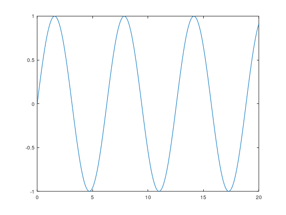

x =

 Columns 1 through 8:

         0    0.1000    0.2000    0.3000    0.4000    0.5000    0.6000    0.7000

 Columns 9 through 16:

    0.8000    0.9000    1.0000    1.1000    1.2000    1.3000    1.4000    1.5000

 Columns 17 through 24:

    1.6000    1.7000    1.8000    1.9000    2.0000    2.1000    2.2000    2.3000

 Columns 25 through 32:

    2.4000    2.5000    2.6000    2.7000    2.8000    2.9000    3.0000    3.1000

 Columns 33 through 40:

    3.2000    3.3000    3.4000    3.5000    3.6000    3.7000    3.8000    3.9000

 Columns 41 through 48:

    4.0000    4.1000    4.2000    4.3000    4.4000    4.5000    4.6000    4.7000

 Columns 49 through 56:

    4.8000    4.9000    5.0000    5.1000    5.2000    5.3000    5.4000    5.5000

 Columns 57 through 64:

    5.6000    5.7000    5.8000    5.9000    6.0000    6.1000    6.2000    6.3000

 Columns 65 through 72:

    6.4000    6.5000    6.6000    6.7000    6.8000    6.9000    7.0000    7.1000

 Columns 73 through 80:

    7.2000    7.3000    7.4000    7.5000    7.6000    7.7000    7.8000    7.9000

 Columns 81 through 88:

    8.0000    8.1000    8.2000    8.3000    8.4000    8.5000    8.6000    8.7000

 Columns 89 through 96:

    8.8000    8.9000    9.0000    9.1000    9.2000    9.3000    9.4000    9.5000

 Columns 97 through 104:

    9.6000    9.7000    9.8000    9.9000   10.0000   10.1000   10.2000   10.3000

 Columns 105 through 112:

   10.4000   10.5000   10.6000   10.7000   10.8000   10.9000   11.0000   11.1000

 Columns 113 through 120:

   11.2000   11.3000   11.4000   11.5000   11.6000   11.7000   11.8000   11.9000

 Columns 121 through 128:

   12.0000   12.1000   12.2000   12.3000   12.4000   12.5000   12.6000   12.7000

 Columns 129 through 136:

   12.8000   12.9000   13.0000   13.1000   13.2000   13.3000   13.4000   13.5000

 Columns 137 through 144:

   13.6000   13.7000   13.8000   13.9000   14.0000   14.1000   14.2000   14.3000

 Columns 145 through 152:

   14.4000   14.5000   14.6000   14.7000   14.8000   14.9000   15.0000   15.1000

 Columns 153 through 160:

   15.2000   15.3000   15.4000   15.5000   15.6000   15.7000   15.8000   15.9000

 Columns 161 through 168:

   16.0000   16.1000   16.2000   16.3000   16.4000   16.5000   16.6000   16.7000

 Columns 169 through 176:

   16.8000   16.9000   17.0000   17.1000   17.2000   17.3000   17.4000   17.5000

 Columns 177 through 184:

   17.6000   17.7000   17.8000   17.9000   18.0000   18.1000   18.2000   18.3000

 Columns 185 through 192:

   18.4000   18.5000   18.6000   18.7000   18.8000   18.9000   19.0000   19.1000

 Columns 193 through 200:

   19.2000   19.3000   19.4000   19.5000   19.6000   19.7000   19.8000   19.9000

 Column 201:

   20.0000

y =

 Columns 1 through 8:

        0   0.0998   0.1987   0.2955   0.3894   0.4794   0.5646   0.6442

 Columns 9 through 16:

   0.7174   0.7833   0.8415   0.8912   0.9320   0.9636   0.9854   0.9975

 Columns 17 through 24:

   0.9996   0.9917   0.9738   0.9463   0.9093   0.8632   0.8085   0.7457

 Columns 25 through 32:

   0.6755   0.5985   0.5155   0.4274   0.3350   0.2392   0.1411   0.0416

 Columns 33 through 40:

  -0.0584  -0.1577  -0.2555  -0.3508  -0.4425  -0.5298  -0.6119  -0.6878

 Columns 41 through 48:

  -0.7568  -0.8183  -0.8716  -0.9162  -0.9516  -0.9775  -0.9937  -0.9999

 Columns 49 through 56:

  -0.9962  -0.9825  -0.9589  -0.9258  -0.8835  -0.8323  -0.7728  -0.7055

 Columns 57 through 64:

  -0.6313  -0.5507  -0.4646  -0.3739  -0.2794  -0.1822  -0.0831   0.0168

 Columns 65 through 72:

   0.1165   0.2151   0.3115   0.4048   0.4941   0.5784   0.6570   0.7290

 Columns 73 through 80:

   0.7937   0.8504   0.8987   0.9380   0.9679   0.9882   0.9985   0.9989

 Columns 81 through 88:

   0.9894   0.9699   0.9407   0.9022   0.8546   0.7985   0.7344   0.6630

 Columns 89 through 96:

   0.5849   0.5010   0.4121   0.3191   0.2229   0.1245   0.0248  -0.0752

 Columns 97 through 104:

  -0.1743  -0.2718  -0.3665  -0.4575  -0.5440  -0.6251  -0.6999  -0.7677

 Columns 105 through 112:

  -0.8278  -0.8797  -0.9228  -0.9566  -0.9809  -0.9954  -1.0000  -0.9946

 Columns 113 through 120:

  -0.9792  -0.9540  -0.9193  -0.8755  -0.8228  -0.7620  -0.6935  -0.6181

 Columns 121 through 128:

  -0.5366  -0.4496  -0.3582  -0.2632  -0.1656  -0.0663   0.0336   0.1332

 Columns 129 through 136:

   0.2315   0.3275   0.4202   0.5087   0.5921   0.6696   0.7404   0.8038

 Columns 137 through 144:

   0.8592   0.9060   0.9437   0.9720   0.9906   0.9993   0.9980   0.9868

 Columns 145 through 152:

   0.9657   0.9349   0.8948   0.8457   0.7883   0.7229   0.6503   0.5712

 Columns 153 through 160:

   0.4864   0.3967   0.3031   0.2065   0.1078   0.0080  -0.0919  -0.1909

 Columns 161 through 168:

  -0.2879  -0.3821  -0.4724  -0.5581  -0.6381  -0.7118  -0.7784  -0.8371

 Columns 169 through 176:

  -0.8876  -0.9291  -0.9614  -0.9841  -0.9969  -0.9998  -0.9927  -0.9756

 Columns 177 through 184:

  -0.9488  -0.9126  -0.8672  -0.8132  -0.7510  -0.6813  -0.6048  -0.5223

 Columns 185 through 192:

  -0.4346  -0.3425  -0.2470  -0.1490  -0.0495   0.0504   0.1499   0.2478

 Columns 193 through 200:

   0.3433   0.4354   0.5231   0.6055   0.6820   0.7516   0.8137   0.8676

 Column 201:

   0.9129

[Execution complete with exit code 0]

