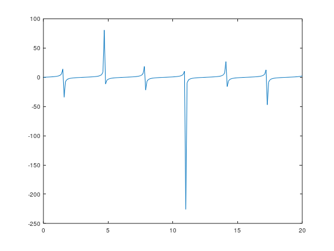

x =

 Columns 1 through 8:

         0    0.1000    0.2000    0.3000    0.4000    0.5000    0.6000    0.7000

 Columns 9 through 16:

    0.8000    0.9000    1.0000    1.1000    1.2000    1.3000    1.4000    1.5000

 Columns 17 through 24:

    1.6000    1.7000    1.8000    1.9000    2.0000    2.1000    2.2000    2.3000

 Columns 25 through 32:

    2.4000    2.5000    2.6000    2.7000    2.8000    2.9000    3.0000    3.1000

 Columns 33 through 40:

    3.2000    3.3000    3.4000    3.5000    3.6000    3.7000    3.8000    3.9000

 Columns 41 through 48:

    4.0000    4.1000    4.2000    4.3000    4.4000    4.5000    4.6000    4.7000

 Columns 49 through 56:

    4.8000    4.9000    5.0000    5.1000    5.2000    5.3000    5.4000    5.5000

 Columns 57 through 64:

    5.6000    5.7000    5.8000    5.9000    6.0000    6.1000    6.2000    6.3000

 Columns 65 through 72:

    6.4000    6.5000    6.6000    6.7000    6.8000    6.9000    7.0000    7.1000

 Columns 73 through 80:

    7.2000    7.3000    7.4000    7.5000    7.6000    7.7000    7.8000    7.9000

 Columns 81 through 88:

    8.0000    8.1000    8.2000    8.3000    8.4000    8.5000    8.6000    8.7000

 Columns 89 through 96:

    8.8000    8.9000    9.0000    9.1000    9.2000    9.3000    9.4000    9.5000

 Columns 97 through 104:

    9.6000    9.7000    9.8000    9.9000   10.0000   10.1000   10.2000   10.3000

 Columns 105 through 112:

   10.4000   10.5000   10.6000   10.7000   10.8000   10.9000   11.0000   11.1000

 Columns 113 through 120:

   11.2000   11.3000   11.4000   11.5000   11.6000   11.7000   11.8000   11.9000

 Columns 121 through 128:

   12.0000   12.1000   12.2000   12.3000   12.4000   12.5000   12.6000   12.7000

 Columns 129 through 136:

   12.8000   12.9000   13.0000   13.1000   13.2000   13.3000   13.4000   13.5000

 Columns 137 through 144:

   13.6000   13.7000   13.8000   13.9000   14.0000   14.1000   14.2000   14.3000

 Columns 145 through 152:

   14.4000   14.5000   14.6000   14.7000   14.8000   14.9000   15.0000   15.1000

 Columns 153 through 160:

   15.2000   15.3000   15.4000   15.5000   15.6000   15.7000   15.8000   15.9000

 Columns 161 through 168:

   16.0000   16.1000   16.2000   16.3000   16.4000   16.5000   16.6000   16.7000

 Columns 169 through 176:

   16.8000   16.9000   17.0000   17.1000   17.2000   17.3000   17.4000   17.5000

 Columns 177 through 184:

   17.6000   17.7000   17.8000   17.9000   18.0000   18.1000   18.2000   18.3000

 Columns 185 through 192:

   18.4000   18.5000   18.6000   18.7000   18.8000   18.9000   19.0000   19.1000

 Columns 193 through 200:

   19.2000   19.3000   19.4000   19.5000   19.6000   19.7000   19.8000   19.9000

 Column 201:

   20.0000

z =

 Columns 1 through 7:

          0     0.1003     0.2027     0.3093     0.4228     0.5463     0.6841

 Columns 8 through 14:

     0.8423     1.0296     1.2602     1.5574     1.9648     2.5722     3.6021

 Columns 15 through 21:

     5.7979    14.1014   -34.2325    -7.6966    -4.2863    -2.9271    -2.1850

 Columns 22 through 28:

    -1.7098    -1.3738    -1.1192    -0.9160    -0.7470    -0.6016    -0.4727

 Columns 29 through 35:

    -0.3555    -0.2464    -0.1425    -0.0416     0.0585     0.1597     0.2643

 Columns 36 through 42:

     0.3746     0.4935     0.6247     0.7736     0.9474     1.1578     1.4235

 Columns 43 through 49:

     1.7778     2.2858     3.0963     4.6373     8.8602    80.7128   -11.3849

 Columns 50 through 56:

    -5.2675    -3.3805    -2.4494    -1.8856    -1.5013    -1.2175    -0.9956

 Columns 57 through 63:

    -0.8139    -0.6597    -0.5247    -0.4031    -0.2910    -0.1853    -0.0834

 Columns 64 through 70:

     0.0168     0.1173     0.2203     0.3279     0.4428     0.5683     0.7091

 Columns 71 through 77:

     0.8714     1.0649     1.3046     1.6166     2.0493     2.7060     3.8523

 Columns 78 through 84:

     6.4429    18.5068   -21.7151    -6.7997    -3.9824    -2.7737    -2.0914

 Columns 85 through 91:

    -1.6457    -1.3264    -1.0820    -0.8856    -0.7211    -0.5789    -0.4523

 Columns 92 through 98:

    -0.3367    -0.2286    -0.1254    -0.0248     0.0754     0.1770     0.2824

 Columns 99 through 105:

     0.3939     0.5146     0.6484     0.8008     0.9799     1.1980     1.4757

 Columns 106 through 112:

     1.8499     2.3947     3.2841     5.0478    10.4312  -225.9508    -9.5414

 Columns 113 through 119:

    -4.8234    -3.1828    -2.3363    -1.8114    -1.4479    -1.1766    -0.9627

 Columns 120 through 126:

    -0.7864    -0.6359    -0.5034    -0.3837    -0.2729    -0.1679    -0.0665

 Columns 127 through 133:

     0.0336     0.1344     0.2380     0.3466     0.4630     0.5908     0.7347

 Columns 134 through 140:

     0.9015     1.1014     1.3511     1.6790     2.1398     2.8526     4.1371

 Columns 141 through 147:

     7.2446    26.8932   -15.8942    -6.0869    -3.7167    -2.6341    -2.0041

 Columns 148 through 154:

    -1.5850    -1.2810    -1.0462    -0.8560    -0.6959    -0.5567    -0.4322

 Columns 155 through 161:

    -0.3181    -0.2110    -0.1084    -0.0080     0.0923     0.1944     0.3006

 Columns 162 through 168:

     0.4134     0.5360     0.6725     0.8288     1.0134     1.2398     1.5305

 Columns 169 through 175:

     1.9267     2.5127     3.4939     5.5344    12.6706   -47.0730    -8.2076

 Columns 176 through 182:

    -4.4460    -3.0051    -2.2318    -1.7415    -1.3971    -1.1373    -0.9308

 Columns 183 through 189:

    -0.7595    -0.6125    -0.4825    -0.3645    -0.2549    -0.1507    -0.0496

 Columns 190 through 196:

     0.0505     0.1516     0.2558     0.3655     0.4836     0.6137     0.7609

 Columns 197 through 201:

     0.9324     1.1394     1.3997     1.7451     2.2372

[Execution complete with exit code 0]

